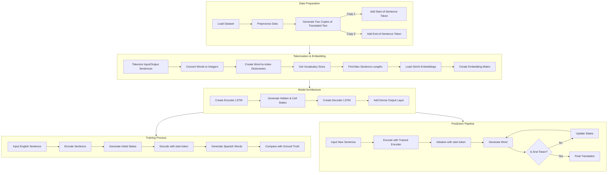

# 🌐 Neural Language Translation System
## English-to-Spanish Translation Using Advanced Deep Learning

[](https://tensorflow.org)
[](https://keras.io)
[](https://python.org)

> Building a sophisticated English-to-Spanish translation model using neural machine translation with sequence-to-sequence architecture.

## 🎯 Key Features

- **Encoder-Decoder LSTM Architecture**
- **Pre-trained GloVe Embeddings**
- **Sequence-to-Sequence Learning**
- **Bidirectional Processing**

## 🧠 Background

The system leverages an **Encoder-Decoder LSTM model** with ***seq2seq*** architecture to tackle ***many-to-many* sequence problems**. This powerful architecture excels at:

- 📝 Text Summarization
- 🤖 Chatbot Development
- 💬 Conversational Modeling
- 🔄 **Neural Machine Translation**

## 🛠️ Technical Requirements

```bash
# Core Dependencies
pip install -r requirements.txt

# For visualization support
brew install graphviz
```

### Required Libraries
- 🔵 TensorFlow
- 🟡 Keras
- 🟢 NumPy
- 🟣 Graphviz

## 📊 Dataset

Access the training corpus here: [Anki Spanish-English Dataset](http://www.manythings.org/anki/) 
> Download `spa-eng.zip` and extract to `data/spa-eng/spa.txt`

## 🔄 Workflow Overview




## 🏗️ Architecture Overview

The **Neural Machine Translation** model consists of two primary components:

### 1. Encoder LSTM
- **Input:** Original English sentence
- **Output:** Encoded representation + states

### 2. Decoder LSTM
- **Input:** Encoder states + start token
- **Output:** Translated Spanish sentence

## 🔄 Processing Pipeline

1. **Data Preprocessing**
   - Raw text processing
   - Special token insertion (`<sos>`, `<eos>`)

2. **Tokenization & Embedding**
   - Word-to-integer conversion
   - Dictionary creation
   - Length normalization
   - GloVe embedding integration

3. **Training Process**
   - Bidirectional encoding
   - State generation
   - Sequential decoding
   - Error comparison

4. **Prediction Pipeline**
   - New sentence encoding
   - Iterative word generation
   - Translation assembly

## 💫 Advanced Features

### Word Embeddings
We utilize [Stanford's GloVe](https://nlp.stanford.edu/projects/glove/) embeddings for enhanced semantic understanding:
- 100-dimensional word vectors
- Pre-trained on massive corpora
- Rich semantic relationships

### Padding Strategy
- **Encoder:** Zero-padding at start
- **Decoder:** Zero-padding at end
- Ensures consistent input dimensions

## 🚀 Improvements & Future Work

1. **Training Enhancements**
   - Increase training epochs
   - Expand dataset size
   - Implement dropout

2. **Architecture Updates**
   - Add attention mechanisms
   - Implement beam search
   - Enhanced context handling

## ⚡ Quick Start

```python
# Example usage
from translator import NeuralTranslator

translator = NeuralTranslator()
translator.load_model('pretrained_weights.h5')

english_text = "Hello, how are you?"
spanish_translation = translator.translate(english_text)
```

## 📈 Performance Notes

- Current training: 5 epochs
- Dataset: 20,000 sentence pairs
  - Training: 18,000
  - Validation: 2,000

## 🎯 Conclusions

The system demonstrates the power of:
- ✅ Advanced NLP techniques
- ✅ Sequence-to-sequence learning
- ✅ LSTM-based encoding/decoding
- ✅ Neural machine translation
